# **GENERALA HEIDENREICH**
Aplicacion para un sistema de Partidas de Generala desarrollada por Alejandro Heidenreich.

## Sobre mi:
Hola, soy Alejandro Heidenreich estudiante en Tecnico Universitario en Programacion (UTN-FRA). Disfrute mucho este trabajo, fue un desafio al tener que entender e investigar como plantearia el funcionamiento de la administracion de una aerolinea, con esto aprendi las diferentes posturas para resolver un mismo problema. Me dirvti mucho durante esta experiencia y seguire avanzando en mi aplicacion en el futuo.

## **Resumen**

### Log In
Al correr la apliacion se presenta con una venta para realizar el **Log In**. 

En el cual se le pedira al usuario ingresar su **Nombre de Usuario** y **Contraseña**. El _Nombre de Usuario_ debera ser unico y no repetirse con los demas usuarios, y la _Contraseña_ debera tener un largo de por lo menos ocho digitos, contener una minuscula, una mayuscula, un numero y un simbolo.

Esta ventana consta con tres botones:
* **Ingresar** : Verificando los campos ingresados, ingresara al **Menu Principal** de la apliacion, caso contrario informara un mensaje con el _error_
* **©** _(Autocompletar)_ : Autocompleta los campos _Usuario_ y _Contraseña_ con datos validos para el facil acceso.
* **X** _(Salir)_ : Cerrara la ventanta y terminara con la aplicacion.

Tambien contiene una opcion para si el usuario se olvido la contraseña, haciendo click en este link, mostrara un mensaje y terminara la aplicacion.

### **Menu Principal**
Una vez correctamente el usuario loggeado, tiene acceso a la ventana del **Menu Principal** 

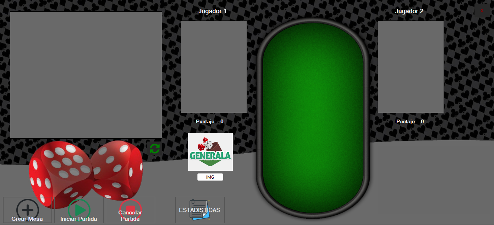

Con esta venta visualizar y administrar las partidas de la aplicacion, consta de los siguientes botones :
* **Crear Mesa** : crea una mesa, para eso deberemos elegir dos jugadores y luego se podra visualizar dicha partida en el datagrid de la izquierda.
* **Clientes** : abre el formulario _MDI_ para administrar los clintes.
* **Vuelos** : abre el formulario _MDI_ para administrar los vuelos.
* **Cuenta** : despliega dos opciones
    - Configurar Cuenta: abre el formulario _MDI_ para administrar la cuenta del usuario.
    - Cerrar Sesion: cierra el _Menu Principal_ y vuelve al _Log In_.
* **Horario** : muestra o esconde la hora.
* **Cerrar** : cierra la aplicacion.

### **Clientes**
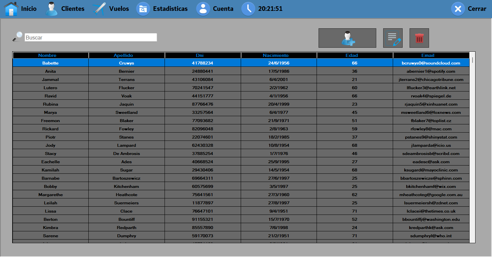
Podremos visualizar una lista de **Clientes** con los datos :

* Nombre
* Apellido
* DNI
* Fecha de Nacimiento
* Edad
* E-Mail

Consta de una caja de texto donde puede filtrar por _Nombre_, _Apellido_ o _DNI_, dependiendo de lo que ingrese el usuario; y de tres botones _Agregar Nuevo Cliente_, _Editar Cliente_ y _Eliminar Cliente_

#### **Agregar Nuevo Cliente**
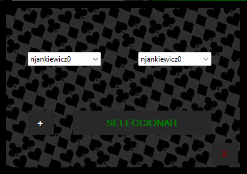

Este boton abre un formulario que consta con dos botones

* Confirmar : una vez verificado los datos agrega el cliente, caso contrario muestra un mensaje de error ( ningun _Campo_ puede estar vacio, el _Dni_ debe ser de 1.000.000 a 99.999.999, debe ser mayor que la fecha actual y el _E-Mail_ debe contener una @ _"arroba"_ )
* Salir : cierra el formulario sin cargar ningun cliente

#### **Editar Cliente**
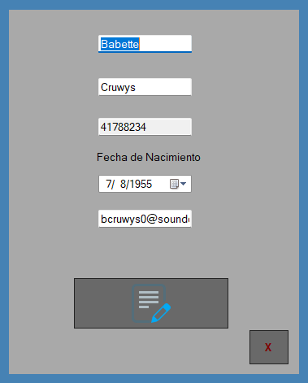

Este boton abre un formulario que se inicializa con todos los campos con los datos del cliente seleccionado y consta con dos botones

* Confirmar Edicion : una vez verificado los datos agrega el cliente, caso contrario muestra un mensaje de error ( ningun _Campo_ puede estar vacio, el _Dni_ no se puede editar, debe ser mayor que la fecha actual y el _E-Mail_ debe contener una @ _"arroba"_ )
* Salir : cierra el formulario sin editar el cliente

#### **Eliminar Cliente**
Este boton elimina los datos del cliente seleccionado, antes saltara una ventana para confirmar la accion. Si se confirma la accion, se elimninara el cliente de la base de datos, caso contrario no se hara ningun cambio.

### **Vuelos**

Podremos visualizar una lista de **Vuelos Actuales**, es decir buenos que no pasaron de la fecha, con los datos :

* ID del Vuelo
* Origen
* Destino
* Tipo
* Duracion
* Disponibilidad (Cantidad de pasajeros, Completo, En Vuelo o Finalizado)
* Partida
* Wifii
* Comida
* Menu Vegano
* Menu Premium
* Bebidas Sin Alcohol
* Bebidas Alcoholicas

Consta de una caja de texto donde puede filtrar por _Origen_, _Destino_, o por _Tipo_ ( _Internacional_ o _Nacional_ ), dependiendo de lo que ingrese el usuario; y de cuatro botones :
* Vender Pasaje ( Solo se podra utilizar si la disponibilidad lo permite )
* Agregar Nuevo Vuelo ( Agregara un nuevo vuelo a la lista de vuelos Activos )
* Examinar Vuelo ( Se podra acceder a la informacion mas detallada del vuelo que esta seleccionado )
* Eliminar Vuelo ( Se eliminara el vuelo seleccioando )

#### **Vender Pasaje**
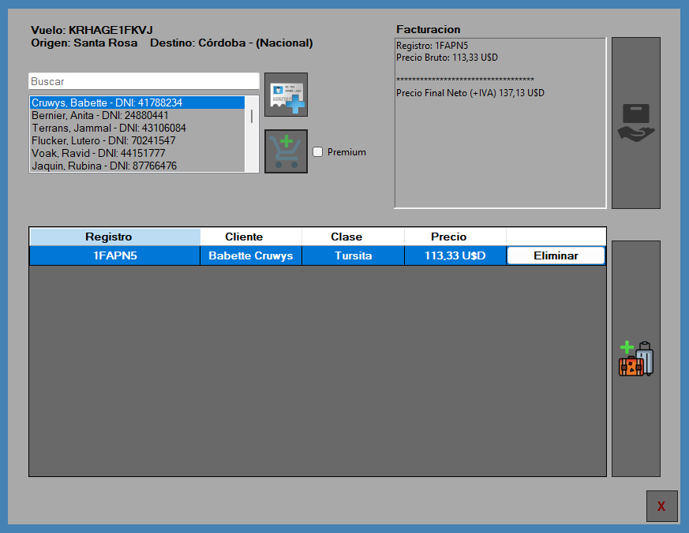

Este boton abre un formulario que muestra informacion del vuelo que se desea vender, un _listbox_ con la lista de clientes en la base de datos, con la opcion de agregar un nuevo cliente haciedo click en el boton _Agregar Nuevo Cliente_.

Una vez seleccionado el cliente deseado, marcando si este cliente va a adquirir un pasaje _Premium_ o por defecto _Tursita_, haciendo click en el boton _Agregar a Compra_, este cliente se convertira en pasajero y se podra visualizar en el _data grid_ mostrando :
* ID de Registro
* Cliente ( Nombre y Apellido )
* Clase ( Premium o Turista )
* Precio Base
* Eliminar ( boton para eliminar pasajero del carrito de compras )

Seleccionado un pasajero del _data grid_ y haciendo click en el boton _Añadir Equipaje al Pasajero_, el usuario podra asignarle equipajes a dicho pasajero mediante el siguiente formulario :
#### Agregar Equipaje 
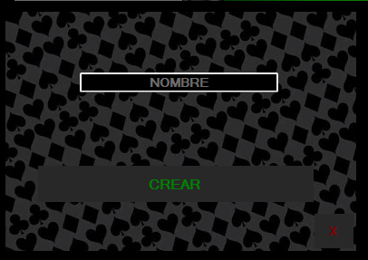

Figurara los datos del pasajero que se le agregara el equipaje. Un _checkbox_ para detallar que el pasajero llevara equipaje de mano, por defecto no.

Un _NumericUpDown_ para designar un peso al equipaje de bodega, que se agregara al _listbox_ una vez dado click al boton _Agregar Equipaje_ hasta un limite de cuatro equipajes por pasajero.

Tambien cuenta con un boton _Eliminar Equipaje_ para sacarlo de la lista.

Una vez que el usuario haya finalizado con la carga de los equipajes podra dar clic en el boton _Confirmar_ para aceptar la carga o en el boton _Cancelar_ para descartar cualquier accion.

Volviendo a la ventanta anterior podiendo visualizar la facturacion de la operacion _Precio Bruto_, _Adicional por Clase Premium_ ( un 15% adicional al Precio Bruto ), _Adicional por Peso Adicional_ ( un 1% adicional al Precio Bruto ) y _Precio Final + IVA_.

El usuario puede seguir agregando pasajes hasta un maximo de cinco pasajes por pasajero, permitiendo designar la clase que desea si es posible y si el vuelo no esta completo.

Al momento de estar conforme con la operacion el usuario puede dar click en _Terminar Operacion_ y creara un archivo _xlsx_ con la facutracion del ticket creado mediante el **Paquete Nuget: IronXL**, caso contrario el usuario tambien puede cancelar todo el proceso y no realizar ningun cambio pulsando el boton _X ( Salir )_.

### **Agregar Nuevo Vuelo**
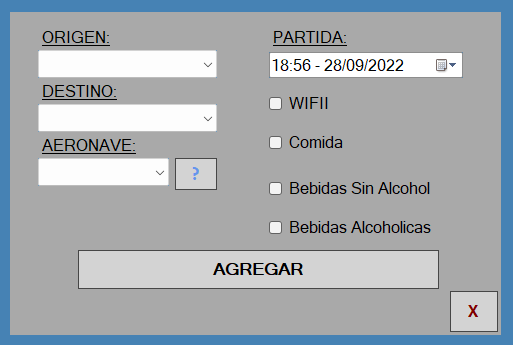

Esta ventana va a permitir Crear un Nuevo Vuelo, designando un _Origen_ y _Destino_ ( Validando que no sean iguales, y si es _Internacional_ debe tener como origen o destino _"Buenos Aires"_ ), una _Aeronave( Matricula )_  y una _Partida_ ( Validando que la aeronave no tiene un vuelo ya designado en ese dia de la partida; y la partida tiene que ser mayor a la actual en el momento del ingreso ). Tambien marcara con los _checkbox_ los serivicios extra que tendra este vuelo como _Wifii_, _Comida_ ( si tiene comida los _Menus_), _Bebidas Sin Alcohol_ y _Bebidas Alcoholicas_.

Consta de tres botones:
* Agregar : si todos los campos son correctos creara un nuevo vuelo, caso contrario dara un mensaje de error.
* X ( Salir ) : cerrara la ventana descartando la creacion del vuelo.
* ? ( Lista de las Aeronaves ) : abrira una ventana con la informacion de las aeronaves
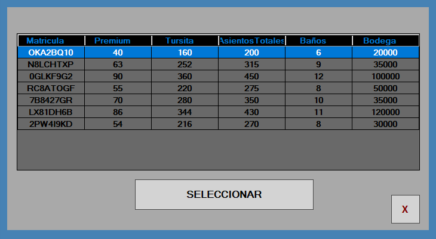
Al clickear _Seleccionar_ retornara en el campo _Aeronave_ la matricula correspondiente a la aeronave seleccionada. O click en X ( Salir ) y no retornara nada.

### **Examinar Vuelo**
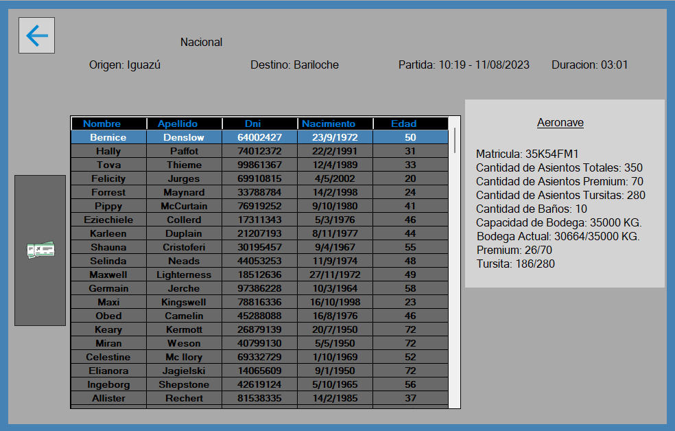
En esta ventana se podra visualizar datos generales del vuelo,
la lista de clientes asociados al vuelo, la informacion de la aeronaves y un boton, que segun el cliente seleccionado, abrira otra ventana para visualizar la informacion del pasajero.
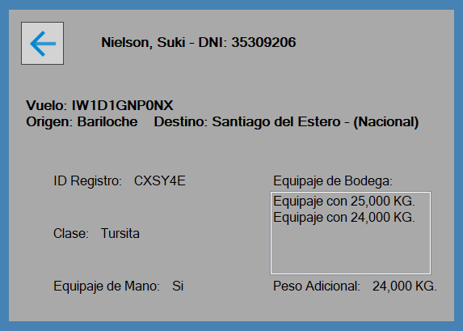
Ambos tienen un boton para retroceder, solo son formularios informativos.

### **Eliminar Vuelo**
Segun el vuelo seleccionado, saltara una ventana para confirmar la eliminacion del vuelo, si es aceptada el vuelo se eliminara de la lista en la Base de Datos, caso contrario no se realizara ningun cambio.

### **Estadisticas**
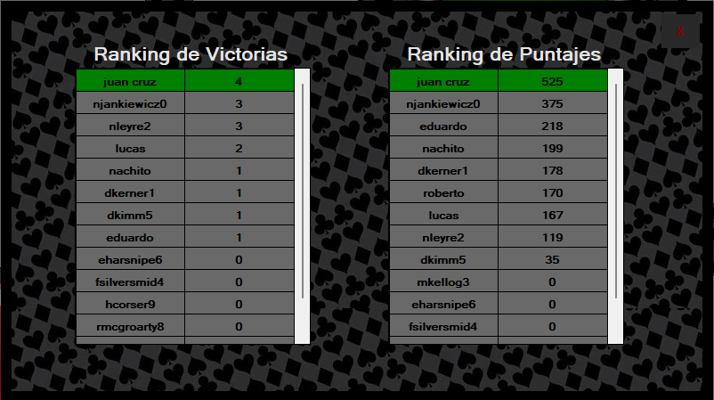
Sobre los vuelos **ya realizados** muestra informacion de los mismos :
* Los destinos ordenados por facturacion
* Clientes ordenados por cantidad de vuelos adquiridos
* El destino mas solicitado en el sistema
* Ganacias totales, por cabojate y por internacional
* Cantidad de horas de cada aeronave

### **Cuenta**
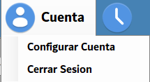
* **Cerrar Sesion** : Cerrar el _menu principal_ y volvera al _log in_.

* **Configurar Cuenta** : abre la siguiente ventana.

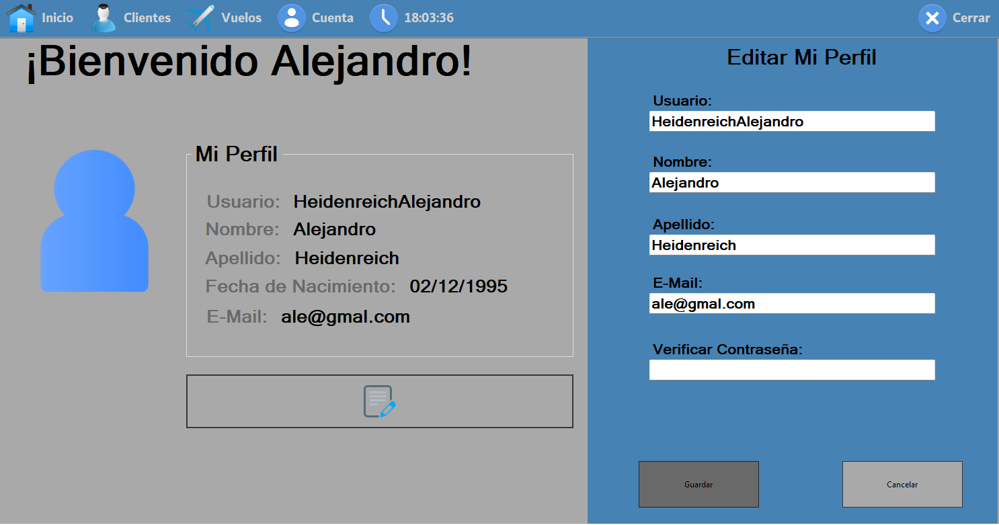
Se podra visualizar la informacion del usuario, con un boton _Editar Perfil_ se desplegara un panel con los datos precargados con dos botones, _Guardar_ y _Cancelar_.
* Guardar : verificando que la contraseña sea correcta y validando todos los campo, cambiara los datos del usuario, caso contrario se mostrara un mensaje de error.
* Cancelar : descartara cambios y ocultara el panel de edicion.

### **Hora**
Haciendo click ocultara o mostrara la hora actual ( por defecto es visible ).

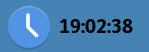

### **Cerrar**
Cerrara inmediatamente la aplicacion.

## Diagrama de Clases
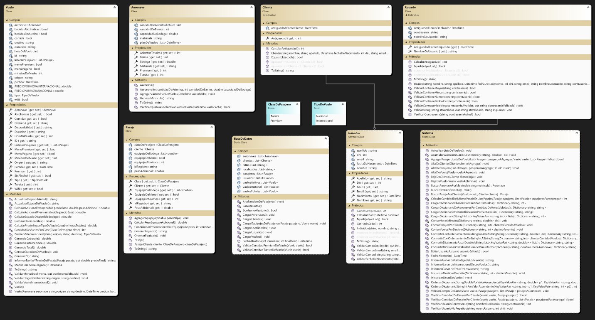

## Justificación técnica

* Introducción a .NET y C#
* Clases y métodos estáticos

    - Clase Estatica BaseDeDatos : al ser una clase que contiene la informacion de las lista y hardcodeos de los datos, encapsulados a la clase para no poder hardcodear fuera de la clase, que se van a utilizar a lo largo de la aplicacion no necesito que se instancien
        
    - Clase Estatica Sistema : es una clase con todos metodos estaticos para interactuar entre objetos instanciados, con otros obejtos o listas estaticas de BaseDeDatos

* Programación orientada a objetos : mediante la abstraccion pude determinar las siguentes clases con la capadidad de instanciar objetos

    - Individuo
    - Cliente : Individuo
    - Usuario : Individuo
    - Pasaje
    - Aeronave
    - Vuelo
    
    
* Sobrecarga :
    - Pasaje y Aeronave, tiene sobrecarga de constructores para instanciar listas o valores de atributos que tienen por defecto.
    - Metodo de Sistemas VerificarPasajeComprar, tiene sobrecarga, uno recibe un pasaje solo, y otro recibe tambien una lista de pasaje

* Windows Forms :
    - FrmLogIn
    - FrmMenuPrincipal
    - FrmAdminstracionDeVuelos
    - FrmVentaVuelo
    - FrmInformacionDeVuelos
    - FrmAltaVuelo
    - FrmAeronaves
    - FrmInformacionDelPasajero
    - FrmAltaEquipaje
    - FrmEstadisitcasHistoricas
    - FrmConfiguracionCuenta

* Colecciones
    - Listas : se utilizan en la clase estatica BaseDeDatos y en las clases instanciadas de objetos, como listaDePasajeros en Vuelo
    - Diccionarios : se utilizan para informar estadisticas historicas en la clase Sistema 
* Encapsulamiento

    - Todas las clases estan encapsuladas ya que atributos, metodos privados restringen el acceso al usuario y solo brindar los necesarios. Ejemplo la clase Usuario, no puede brindar informacion de la contraseña al usuario.
* Herencia

    - Hay herencias de Individuo ( Abstract ) es padre de Cliente y Usuario

* Polimorfismo y clases abstractas

    - Clase Abstracta **Individuo** : esta clase tiene un metodo abstracto _public abstract int CalcularAntiguedad()_ que las clases hijas Cliente y Usuario deberan implementar. 
    * Todas las clases que no sean static tiene sobrecargas de ToString, algunas de Equals y GetHashCode 

## Propuesta de valor agregado 
En mi aplicacion propuse las siguientes funcionalidades:

* El usuario puede acceder a su informacion y editar ciertos datos de ella. (_Configurar Cuenta_)
* Eliminar Vuelos Activos, desde la administracion de vuelos
* Al vender un pasaje, el pasajero puede llevar hasta 4 equipajes de bodega, si es _Tursita_ tiene 1 valija de hasta 25kg gratis, si esta valija sobrepasa el peso se le cobrara un 1% del precio base adicional por cada kilo sobrepasado, y asi con los demas valijas si es que las tiene.
Y para el _Premium_ tiene hasta 2 valijas de 21 kg sin cargo, si algunas de estas valijas sobrepasa el peso tambien se le adicionara el 1% del precio base.
* Cada ticket operacion de venta que se realiza se guardara un archivo excel en el bin, con los datos de la facturacion, tal cual se puede apreciar en la ventana de venta, esto se logra mediante el nuget _IronXL_
* La aplicacion contiene una funcionalidad de cambio de tema, desde el menu principal

