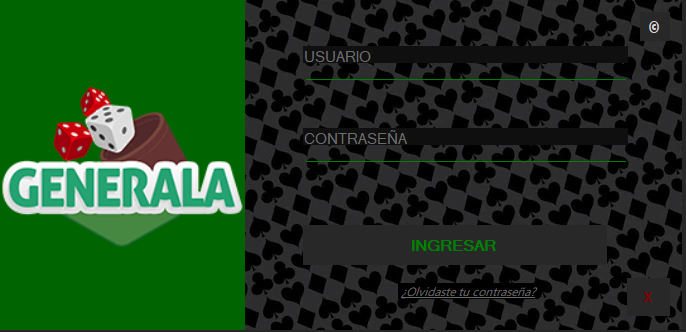
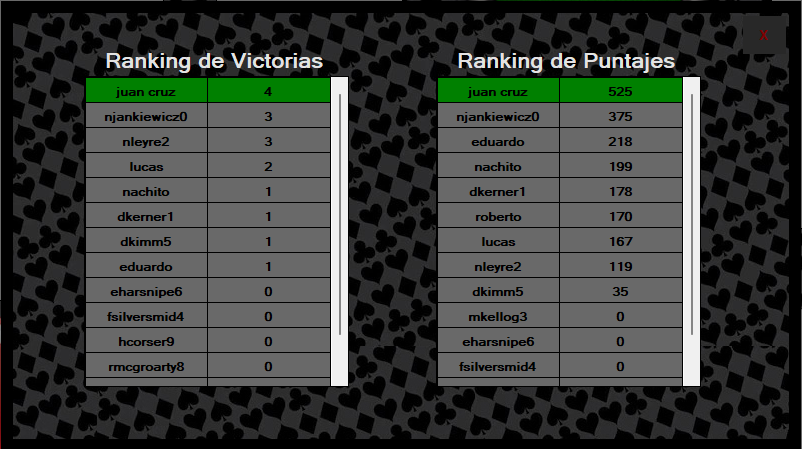

# **GENERALA HEIDENREICH**
Aplicacion para un sistema de Partidas de Generala desarrollada por Alejandro Heidenreich.

## **Reglas de Generala**
Cada jugador puede hacer hasta tres tiros por turno y debe completar una categoría por vuelta, por lo cual al finalizar el juego cada participante tendrá puntaje en cada una de las diez categorías. 
Si en su primer tiro el jugador no esta conforme con su juego, apartará el o los dados que desee conservar y hará su segundo tiro con los restantes. Si lo desea, puede arrojar nuevamente los cinco dados, pues no está obligado todavía a elegir una categoría. Pero una vez terminado la tercer tirada, el jugador estara obligado a finalizar su turno, ya sea realizar un juego sumando su puntaje o tachar un juego que no acumula puntos y este tachado no estara disponible para el jugador durante toda la partida.
### Puntaje: 
Para calcular el puntaje correspondiente a una categoría de número, se multiplica el total de dados donde éste aparece por dicho número. Por ejemplo: tres 6 valen 18 puntos para el seis; dos 4 valen 8 puntos para el cuatro.
### Juegos Mayores:
* Generala: 5 dados del mismo número = 60 pts.
* Poker = 4 dados de un mismo número = 40 pts.
* Full = 3 de un mismo número y un par = 30 pts.
* Escalera = 1-2-3-4-5 ó 2-3-4-5-6 = 20 pts.

## **Resumen de la Aplicacion**
### Log In
Al correr la apliacion se presenta con una venta para realizar el **Log In**. 

En el cual se le pedira al usuario ingresar su **Nombre de Usuario** y **Contraseña**. El _Nombre de Usuario_ debera ser unico y no repetirse con los demas usuarios, y la _Contraseña_ debera tener un largo de por lo menos ocho digitos, contener una minuscula, una mayuscula, un numero y un simbolo.

Esta ventana consta con tres botones:
* **Ingresar** : Verificando los campos ingresados, ingresara al **Menu Principal** de la apliacion, caso contrario informara un mensaje con el _error_
* **©** _(Autocompletar)_ : Autocompleta los campos _Usuario_ y _Contraseña_ con datos validos para el facil acceso.
* **X** _(Salir)_ : Cerrara la ventanta y terminara con la aplicacion.

Tambien contiene una opcion para si el usuario se olvido la contraseña, haciendo click en este link, mostrara un mensaje y terminara la aplicacion.

### **Menu Principal**
Una vez correctamente el usuario loggeado, tiene acceso a la ventana del **Menu Principal** 

Con esta venta visualizar y administrar las partidas de la aplicacion, consta de los siguientes botones :
* **Crear Mesa** : crea una mesa, para eso deberemos elegir dos jugadores en otro formulario y luego se podra visualizar dicha partida en el datagrid de la izquierda.
* **Iniciar Partida** : inicia la partida seleccionada en el datagrid izquierdo y muestra el desarrollo de la misma en la parte derechad de la aplicacion
* **Cancelar Partida** : cancela la partida seleccionada en el datagrid izquierdo, luego de terminar la mano actual, finalizara la partida mostrando el ganador con la puntuacion en ese momento
* **Estadisticas** : se abrira un nuevo formulario mostrando informes de partidas recolectadas de la base datos.

#### **Seleccionar Jugador**

Este formulario permitira elegir a los dos jugadores que se enfrentaran en la partida

* Selecccionar : una vez el usuario seleccione a los jugadores, teniendo en cuenta que no pueden ser iguales y no deben estar participando en ninguna partida al momento de la seleccion.
* Salir: cierra el formulario sin crear una nueva partida
* Crear un nuevo jugador: abrira el siguiente formulario

#### **Crear Jugador**

Este formulario permitira al usuario crear un jugador nuevo y cargarlo a la base de datos.

* Crear : toma el nombre ingrasado y crea un nuevo jugador
* Salir : cierra el formulario crear ningun jugador

### **Estadisticas**

Podremos visualizar dos datagrid de **Rankings**, uno de victorias y otro de puntajes

## Diagrama de Entidades

## Justificación técnica

* SQL :
    - Clase BaseDeDatos: clase que intancia objetos que realizan la conneccion a la base de datos y a base de querys cargan, buscan y calculan informacion.
    

* Unit Testing :
    - Proyecto Generala.Test: esta clase implementa los testing todos los metodos de la aplicacion, cada clase tiene su clase de testeo.
   
* Manejo de excepciones :
    - Se podra visualizar al largo y ancho de la aplicacion, por ejemplo en la base de datos, cada vez que intenta abrir la coneccion tiene que manejarse, al momento del log in si el usuario es correcto, etc.

* Generics :
    - Esta aplicado en la interfaz IPersistenciaDeDatos, SerializadorJSON Y SerializadorXML, para poder manipular cualquier tipo de dato que se les presente y tratarlos de la misma manera.
    
* Serialización :
    - SerializadorJSON Y SerializadorXML: estas son las clases que pueden serializar y deserializar archivos (json y xml) en esta solucion. La clase SerializadorJSON se podra ver utilizada en la creacion de cada juego, para inicializar la tabla del jugador para desarrollar su partida.
    
* Interfaces :
    - IPersistenciaDeDatos: Es una intefaz generica que admite solo clases y fuerza la implementacion de dos metodos, Leer y Escribir. Esta podria ser implementada en cualquier clase que manipule entrada y salida de informacion.

* Delegados :
    - Estan aplicados en la clase Partida, los dos son Action; uno informar el ganador de la partida y otro para informar la tirada del juegador.

* Task : 
    - Al llamar al metodo IniciarPartida() de la clase Partida se iniciara una task ejecutando el metodo SimularPartida() en un hilo secundario. Esta terminara cuando termine el metodo o sea cancelada por el CancellationToken.

* Eventos : 
    - La clase Partida tiene un atributo salidaLogs que es un evento que al ser invocado (al ser un evento dentro de la clase), informara que la partida se actualizo y tiene informacion nueva para mostrar, la cual el usuario la podra visualizar de la manera que implemente la vista segun el metodo que tenga asociado este evento.

