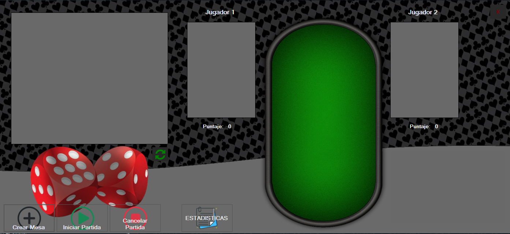

# **GENERALA HEIDENREICH**
Aplicacion para un sistema de Partidas de Generala desarrollada por Alejandro Heidenreich.

## Reglas de Generala:

## **Resumen**

### Log In
Al correr la apliacion se presenta con una venta para realizar el **Log In**. 

En el cual se le pedira al usuario ingresar su **Nombre de Usuario** y **Contraseña**. El _Nombre de Usuario_ debera ser unico y no repetirse con los demas usuarios, y la _Contraseña_ debera tener un largo de por lo menos ocho digitos, contener una minuscula, una mayuscula, un numero y un simbolo.

Esta ventana consta con tres botones:
* **Ingresar** : Verificando los campos ingresados, ingresara al **Menu Principal** de la apliacion, caso contrario informara un mensaje con el _error_
* **©** _(Autocompletar)_ : Autocompleta los campos _Usuario_ y _Contraseña_ con datos validos para el facil acceso.
* **X** _(Salir)_ : Cerrara la ventanta y terminara con la aplicacion.

Tambien contiene una opcion para si el usuario se olvido la contraseña, haciendo click en este link, mostrara un mensaje y terminara la aplicacion.

### **Menu Principal**
Una vez correctamente el usuario loggeado, tiene acceso a la ventana del **Menu Principal** 

Con esta venta visualizar y administrar las partidas de la aplicacion, consta de los siguientes botones :
* **Crear Mesa** : crea una mesa, para eso deberemos elegir dos jugadores en otro formulario y luego se podra visualizar dicha partida en el datagrid de la izquierda.
* **Iniciar Partida** : inicia la partida seleccionada en el datagrid izquierdo y muestra el desarrollo de la misma en la parte derechad de la aplicacion
* **Cancelar Partida** : cancela la partida seleccionada en el datagrid izquierdo, luego de terminar la mano actual, finalizara la partida mostrando el ganador con la puntuacion en ese momento
* **Estadisticas** : se abrira un nuevo formulario mostrando informes de partidas recolectadas de la base datos.

#### **Seleccionar Jugador**

Este formulario permitira elegir a los dos jugadores que se enfrentaran en la partida

* Selecccionar : una vez el usuario seleccione a los jugadores, teniendo en cuenta que no pueden ser iguales y no deben estar participando en ninguna partida al momento de la seleccion.
* Salir: cierra el formulario sin crear una nueva partida
* Crear un nuevo jugador: abrira el siguiente formulario

#### **Crear Jugador**

Este formulario permitira al usuario crear un jugador nuevo y cargarlo a la base de datos.

* Crear : toma el nombre ingrasado y crea un nuevo jugador
* Salir : cierra el formulario crear ningun jugador

### **Estadisticas**

Podremos visualizar dos datagrid de **Rankings**, uno de victorias y otro de puntajes :

## Diagrama de Entidades

## Justificación técnica

* SQL :
    - Clase Estatica BaseDeDatos :
    - Clase Estatica Sistema : 

* Unit Testing :
    - Proyecto Generala.Test: esta clase implementa los testing tod
   
* Manejo de excepciones :
    - Pasaje y Aeronave:

* Generics :
    - FrmLogIn
    
* Serialización :
    - Listas : 
    
* Interfaces :

    - Todas las clases :

* Delegados :
    - Hay herencias de Individuo :

* Task : 
    - Clase Abstracta **Individuo** :

* Eventos : 
    - Clase Abstracta **Individuo** :

